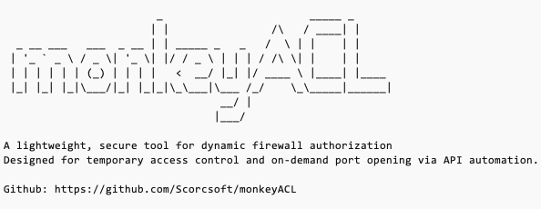

# Monkey ACL


## 简介



Monkey ACL (吗喽ACL) 是一个基于 HTTP API 动态管理防火墙规则的工具。

你是否被以下场景困扰？

你持有一台或多台云服务器，为方便你的移动设备随时远程连接，你必须向互联网开放 RDP 或 SSH ，脑瘫字典机 7 * 24 小时不间断暴力破解你的密码。

基于云厂商提供的安全组限制端口？你需要每次登录云平台手动修改，或者自行编写脚本调用云平台API调整安全组规则。但云平台众多，你需要每个云平台都写一套工具。

Monkey ACL 可以解决你的问题！


## 特性
- 简单易用
- 无需配置、用户无感
- 动态授权、自动回收
- 无视云平台差异


## Get Started

Monkey ACL 使用 Python 标准库实现，无需安装任何第三方模块。

不同的操作系统防火墙的操作方法不同，请根据服务器的实际操作系统和版本运行对应的脚本。


```bash
[root@MyServer monkeyACL]# python3 monkeyACL-centos7.py


                        _                       _____ _
                       | |                /\   / ____| |
  _ __ ___   ___  _ __ | | _____ _   _   /  \ | |    | |
 | '_ ` _ \ / _ \| '_ \| |/ / _ \ | | | / /\ \| |    | |
 | | | | | | (_) | | | |   <  __/ |_| |/ ____ \ |____| |____
 |_| |_| |_|\___/|_| |_|_|\_\___|\___ /_/    \_\_____|______|
                                  __/ |
                                 |___/

A lightweight, secure tool for dynamic firewall authorization
Designed for temporary access control and on-demand port opening via API automation.

Github: https://github.com/Scorcsoft/monkeyACL

Options:
    -h,--help: 		 Show this help message and exit


Required parameter:
    --auth=AUTH: 	 API authentication
    --port=PORT: 	 API HTTP port


Notes:
    For your server security, The length of the --auth parameter must be greater than 16, and it must contain uppercase letters, lowercase letters, numbers, and symbols


Example:
    python3 monkeyACL.py --auth="1*r^(5_N1rrbKo6e" --port=8080


