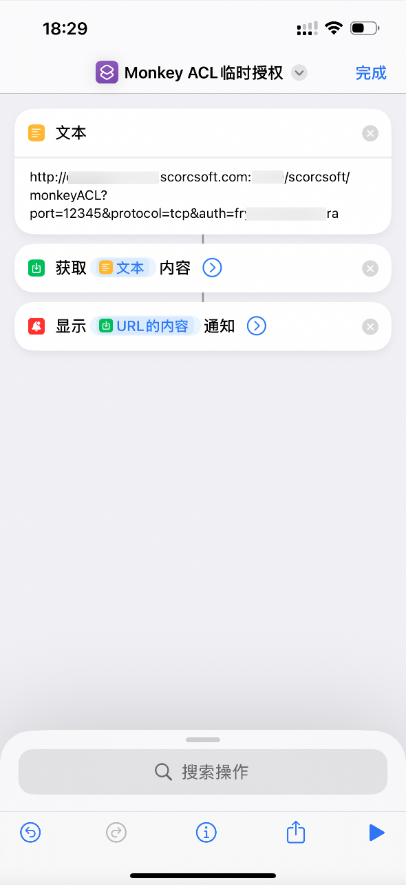
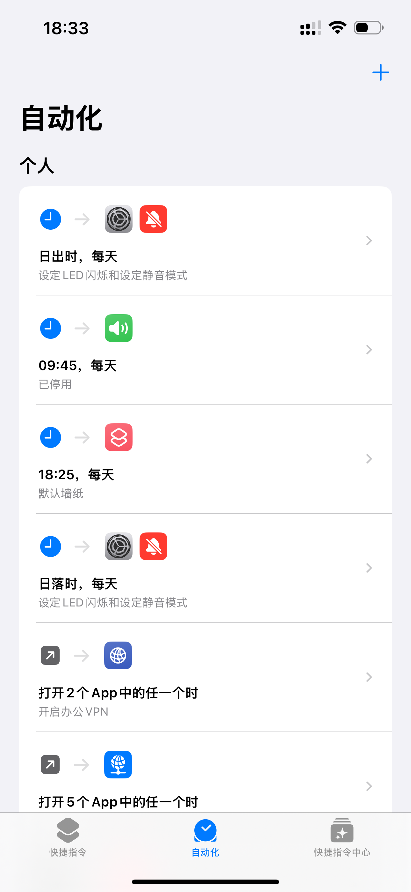
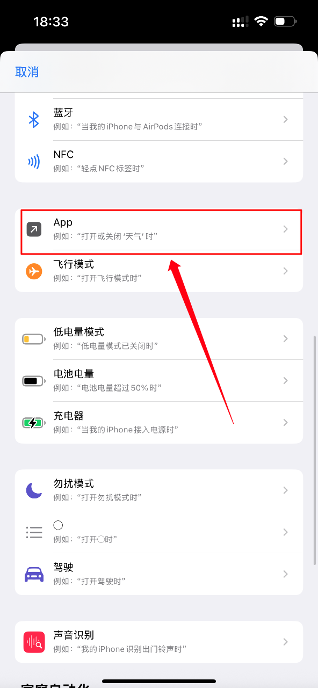
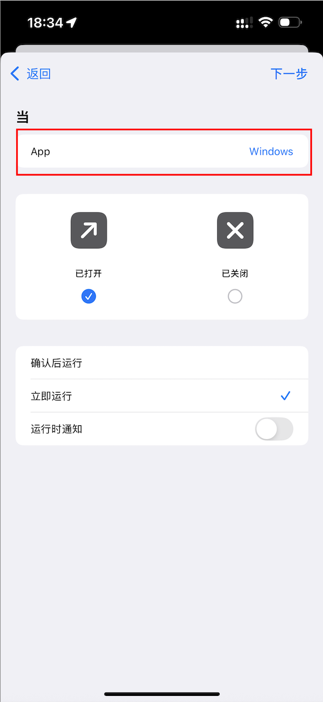
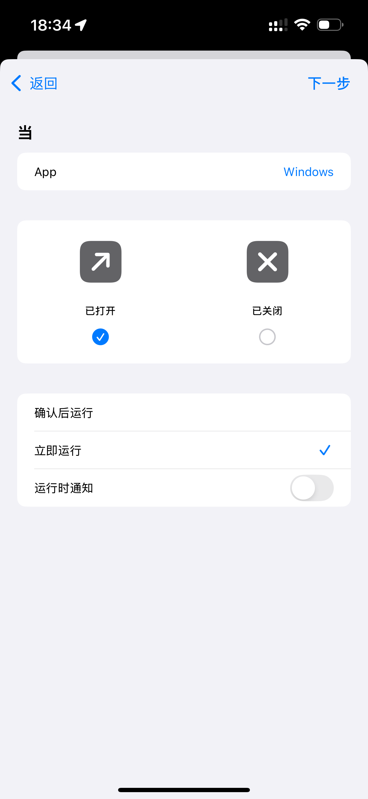
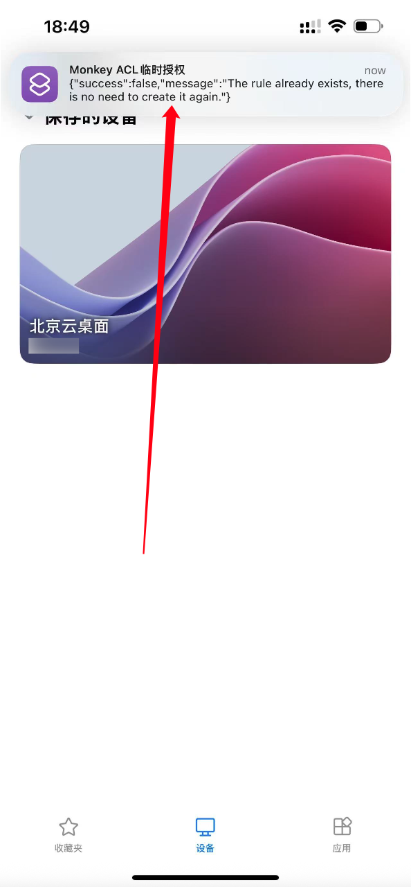

# Monkey ACL


## 🚀 简介


<p align="center">
  
</p>

**Monkey ACL (吗喽ACL)** 是一款基于 HTTP API 的防火墙动态授权管理工具，帮助你安全、高效、智能地管理服务器远程访问权限。

---

### 💡 适用场景

- 持有云服务器，需要远程管理（SSH / RDP），不得不对公网开放端口。
- 面对暴力破解、扫描器等 7×24 小时攻击风险。
- 云厂商安全组配置繁琐，手动操作效率低，还需针对不同云平台开发多套工具。

👉 **Monkey ACL 用一套统一方案，帮你彻底解决这些难题！**

---

## 🌟 特性亮点

✅ **简单易用** — 纯 Python 3 标准库，无需任何第三方依赖。  
✅ **零配置启动** — 单文件运行，参数即配置。  
✅ **动态授权** — API 调用即授权当前 IP 临时访问指定端口。  
✅ **自动回收** — 无需手动清理，失效规则智能移除。  
✅ **平台无关** — 本地防火墙控制，无需依赖云平台 API。  
✅ **高度可集成** — 适配 iPhone Shortcuts、自动化脚本等工具，实现极简体验。

---

## ⚡ 快速开始

### 1️⃣ 克隆项目
```bash
git clone https://github.com/Scorcsoft/MonkeyACL.git
cd MonkeyACL
```

### 2️⃣ 准备 SSL 证书  
Monkey ACL的 API 服务要求一个 .pem 格式的 SSL 证书，以便启用 HTTPS 连接。你可以购买一个商用证书、从 Let's encrypt 免费签发一个证书。

也可以使用以下命令来自己签发一个证书：

```bash
openssl req -x509 -newkey rsa:2048 -keyout key.pem -out cert.pem -days 365 -nodes
```

这将在当前目录生成一个 cert.pem 和 key.pem ，然后在 Monkey ACL 使用它。这个证书的有效期是 365 天。

### 3️⃣ 启动服务  
> 当前版本支持 **CentOS 7**，其他系统版本后续支持。

```bash
sudo python3 monkeyACL-centos7.py --auth=<your-key> --port=<api-port> --url=<api-url> --cert=<path_to_cert_file> --key=<path_to_key_file>
```
> 📝 **root 权限必需**：防火墙规则管理需系统管理员权限。

| 参数    | 说明                          |
|-------|-----------------------------|
| --auth | API 访问密钥，API 请求需携带此密钥       |
| --port | API 服务监听端口，请确保安全组和防火墙已放通此端口 |
| --url | API 服务 URL，建议使用随机字符串，避免被扫描到 |
| --cert | SSL 证书文件路径，需要 pem 格式        |
| --key | SSL 秘钥文件路径，需要 pem 格式        |

启动成功示例：
```text
[root@localhost monkeyACL]# python3 monkeyACL-centos7.py --auth='Geh8uw' --port=3389 --url='vefhuwbyuvftyuvwegfyugvy' --cert=cert.pem --key=key.pem

                        _                       _____ _      
                       | |                /\   / ____| |     
  _ __ ___   ___  _ __ | | _____ _   _   /  \ | |    | |     
 | '_ ` _ \ / _ \| '_ \| |/ / _ \ | | | / /\ \| |    | |     
 | | | | | | (_) | | | |   <  __/ |_| |/ ____ \ |____| |____ 
 |_| |_| |_|\___/|_| |_|_|\_\___|\___ /_/    \_\_____|______|
                                  __/ |                      
                                 |___/                       

A lightweight, secure tool for dynamic firewall authorization
Designed for temporary access control and on-demand port opening via API automation.

Github: https://github.com/Scorcsoft/monkeyACL

[i] MonkeyACL is running at: https://0.0.0.0:3389/vefhuwbyuvftyuvwegfyugvy
[i] Automatically detect network connections and clean up unused rules.

```

---

## 🔑 获取临时访问授权

使用你用来连接服务器的设备访问以下URL：
```bash
curl -X POST -k -d '{"auth": "<your_auth>","port": 8080, "protocol": "tcp"}' "https://chengdu.proxy.scorcsoft.com:4400/<your_api_url>"
```

成功响应：
```json
{"success": true, "message": "Create firewalld rule success"}
```
系统将自动添加来源 IP 到防火墙规则，临时开放访问权限。

---

## 🕒 自动回收机制

👉 Monkey ACL 每隔 **1 分钟** 检测一次已授权 IP 的连接状态。  
👉 **当某 IP 当前没有连接到服务器时，临时授权自动撤销。保障服务器端口最小暴露，无需人工干预。**  


```TEXT

[2025-06-20 17:48:56] The authorized IP: [180.184.***.***] is not connected to this server, its permission will be removed.
[2025-06-20 17:48:58] Successfully removed access permission for [180.***.***.***]

```

如果该设备需要再次访问服务器，请重新访问获取临时授权 API

---

## 📱 iPhone 联动

### 使用 iPhone 快捷指令自动授权，无需每次手动访问

### 1️⃣ 创建快捷指令
打开 iPhone 的快捷指令 app，点击右上角 + 号新建一个快捷指令：

创建以下快捷指令：

<p align="center">
  
</p>

### 2️⃣ 配置快捷指令自动运行

**切换到”自动化“界面**

<p align="center">
  
</p>

**创建自动化**

单击右上角 + 号，创建一个自动化条件：

<p align="center">
  
</p>

**选择 APP**

选择需要服务器访问权限的APP，例如：你的远程桌面客户端或 SSH 客户端

<p align="center">
  
</p>

**修改运行配置**

将该自动化配置为”立即运行“

<p align="center">
  
</p>


### 3️⃣ 完成

打开该 App，iPhone 的快捷指令会在 App 打开时执行设定的快捷执行，访问 Monkey ACL 的 API 将你手机当前的 IP 地址添加到防火墙规则。

<p align="center">
  
</p>


## 📱 Android 联动

我没有 Android 手机，不知道各安卓设备有没有类似快捷指令的 App。尊贵的 Android 用户可以使用浏览器手动访问 API。

---

## 🛠 故障排查

### 访问 API 后设备仍然无法访问？
✅ 检查云平台安全组是否已放通目标端口。  
✅ 确认 API 服务端口在云平台和本机防火墙中均已开放。  
✅ 注意：Monkey ACL 仅管理本地防火墙，不会修改云安全组配置。

---

## 📄 License

MIT

---

## 🤝 欢迎贡献

欢迎提交 Issue 或 PR，共同完善和优化 Monkey ACL！